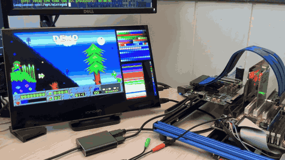

# MiSTVGA

  

This is a port of the ao486 VGA core written by [Aleksander Osman](https://github.com/alfikpl) and updated by the MiSTer dev team from [`ao486_Mister`](https://github.com/MiSTer-devel/ao486_MiSTer/), adapted to run on different FPGA hardware over thed PCI bus.
For FPGA targets using the scaler, the PCI bridge snoops num lock/scroll lock keyboard led activity to control different scaling algorithms & VGA palette visualization.
