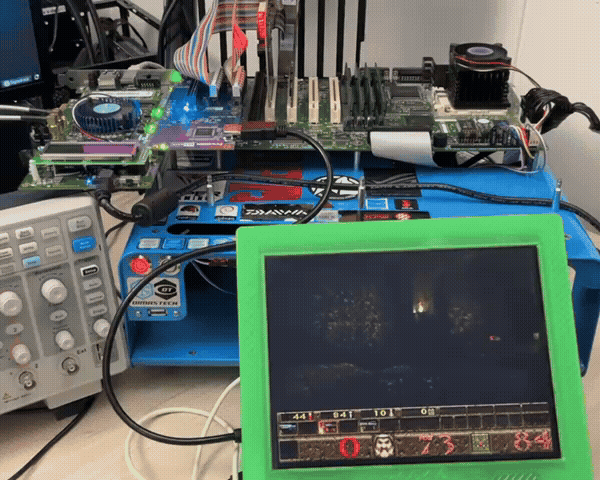

# MiST VGA

This is a speedrun port of the VGA core written by Aleksander Osman and updated by the MiSTer dev team from `ao486_Mister`, adapted to run on an Arria II GX development kit with a PCI target front end.
The original `ao486` VGA IP expected an Avalon-like host-side interface. This is driven by [`rtl/pci_vga_bridge.sv`](rtl/pci_vga_bridge.sv), which translates PCI target transactions into the original VGA I/O and VGA memory accesses.

<p align="center">
  
</p>

## Layout

- `rtl/`: synthesizable RTL for the VGA core, PCI bridge, board wrapper, PLLs, and support blocks
- `fpga/`: Quartus project files for the Arria II GX target
- `sim/`: Verilator-based simulations for the VGA core and the PCI bridge
- `vgabios/`: VGA BIOS sources and ROM patching tools
- `build/`: Quartus output directory generated by `make a2gx`

## Main Components

- `rtl/vga.v`: full `ao486` VGA core
- `rtl/pci_vga_bridge.sv`: PCI target to VGA host-interface bridge
- `rtl/a2gx_mistvga_top.sv`: Arria II GX board wrapper
- `sim/vga_sim_top.sv`: core-level VGA simulation top
- `sim/pci_bridge_test_top.sv`: PCI bridge regression test top

## Requirements

- `make`
- `python3`
- `verilator`
- SDL2 development headers for the VGA simulation
- Quartus Prime Standard / Quartus tools for FPGA builds

## Common Commands

From the repository root:

```sh
make sim
make lint
make a2gx
make prog
make clean
```

Useful simulation targets:

```sh
make -C sim run
make -C sim bridge-run
make -C sim lint-a2gx
```

## Build Notes

- `make a2gx` builds the Quartus project from `fpga/`.
- Quartus outputs are written to `build/`.
- The PCI option ROM image `fpga/boot1.hex` is generated from `vgabios/boot1.rom` by the top-level `Makefile`.
- The bridge simulation also loads that ROM image from `fpga/boot1.hex`.

## Hardware Target

- Board: Arria II GX Development Kit (`DK-DEV-2AGX125N`)
- Video output: parallel RGB into the IT6613 HDMI transmitter on HSMC
- Host interface: 32-bit 33 MHz PCI target


## Intent
Just fun.
